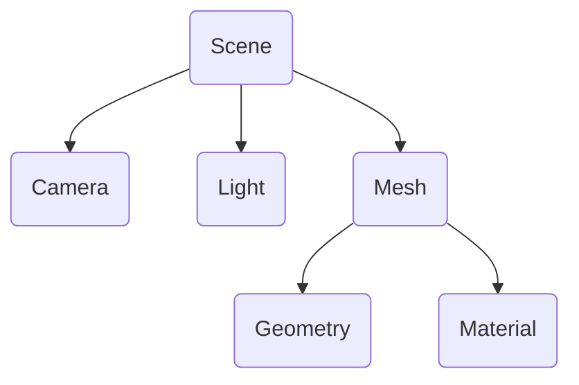

# Three.js
Paulina Lencka, 41271

---
layout: image-right
image: /images/decor_1.png
hideInToc: true
---

# Spis treści
<Toc minDepth="1" maxDepth="1"></Toc>

---
layout: image-right
image: /images/3js_logo.png
---
# Three.js w pigułce
- <div class="flex items-center">Biblioteka JavaScript, API </div>
- Używana do wyświetlania grafiki 3D w przeglądarce webowej
- WebGL, eksperymentalne wsparcie dla WebGPU
- Wysokopoziomowy
- Łatwa integracja z innymi bibliotekami i frameworkami
- Bogata dokumentacja

---

# Instalacja
Przykładowa instalacja dla zwykłego JavaScript

### 1. CDN
Zwykłe załączenie biblioteki po linku.
```html
<script src="https://threejs.org/build/three.js"></script>
```

<br>

### 2. Menedżer pakietów

Instalacja przez npm, np. w środowisku Node:
```sh
npm install three
```

Import w pliku .js:
```js
import * as THREE from 'three';
```

---
layout: two-cols
---
# Scena
- Przestrzeń, w której zamieszcza się obiekty związane z grafiką 3D
- Modele 3D, światła, kamery

<br>


::right::
Scena w programie Blender:


Podstawowa scena w Three.js
```js {all|1|2|6|4-5|8|10-11|all} {at:0}
var scene = new THREE.Scene();
var camera = new THREE.PerspectiveCamera(75, window.innerWidth / window.innerHeight, 0.1, 1000);

var geometry = new THREE.BoxGeometry(1, 1, 1);
var material = new THREE.MeshBasicMaterial({color: 0x00ff00});
var mesh = new THREE.Mesh(geometry, material);

scene.add(mesh);

var light = new THREE.PointLight(0xFFFFFF, 1, 1000);
scene.add(light);
```

---
hideInToc: true
---
# Wyświetlenie sceny

```js {all|1-2|3|4|all} {at:0}
var renderer = new THREE.WebGLRenderer();
renderer.setSize(window.innerWidth, window.innerHeight);
document.body.appendChild(renderer.domElement);
renderer.render(scene, camera);
```

<Scene/>


---
layout: two-cols
---
# Popularne nakładki
Integracje z najpopularniejszymi frameworkami
### Vue.js 
- <div class="flex items-center">Trois.js </div>
- <div class="flex items-center">Tres.js </div>

<br>

### React
- <div class="flex items-center">react-three-fiber </div>

<br>

### Angular
- <div class="flex items-center">angular-three </div>

::right::

Podstawowa scena w Tres.js
```vue
<!-- '@tresjs/core' -->
<template>
  <TresCanvas>
    <TresPerspectiveCamera :position="[0, 0, 5]" />
    <TresPointLight :position="[10, 10, 10]" />
    <TresMesh>
      <TresBoxGeometry :args="[1, 1, 1]" />
      <TresMeshBasicMaterial :color="0x00ff00" />
    </TresMesh>
  </TresCanvas>
</template>
```

---
layout: center
---
# Przykłady

---

## Figury geometryczne
#

<Geometry/>

---

## Model z animacją
#
<ChickenWrapper/>

---
layout: two-cols
---

# GLTF
GL Transmission Format

- Ustandaryzowany format dla scen 3D i modeli
- Przeznaczony do wydajnej transmisji danych zasobów 3D
- Wbudowany JSON opisujący scenę, tekstury, pozycje wierzchołków
- Idealny pod zastosowania webowe

Model kurczaka zapisany jest z rozszerzeniem .glb. Blender umożliwia eksport do tego formatu.
::right::


---
layout: image-right
image: /images/decor_2.png
---

# Zastosowania
Przykłady korzystają z różnych bibliotek z rodziny WebGL

- [Ozdabianie stron wizualizacjami trójwymiarowymi](https://github.com/)
- [Gry przeglądarkowe](https://tympanus.net/codrops/2016/04/26/the-aviator-animating-basic-3d-scene-threejs/)
- [Interaktywne konfiguratory](https://xboxdesignlab.xbox.com/pl-pl/configure/xbox-wireless-controller)
- [Serwis wymiany modeli 3D](https://www.thingiverse.com/)
- Tworzenie doświadczeń VR (wsparcie dla WebVR)
- Reklama produktu
- ? ? ?

---
layout: image-right
image: /images/decor_3.png
---

# Alternatywy

- Natywny WebGL
- <div class="flex items-center">Babylon.js </div>
- <div class="flex items-center">PlayCanvas </div>
- <div class="flex items-center">CesiumJS </div>
- <div class="flex items-center">PixiJS </div>

---
hideInToc: true
layout: center
class: 'text-center'
---
# Pytania?

---
hideInToc: true
layout: center
class: 'text-center'
---
# Dziękuję za uwagę
Paulina Lencka, 41271

---
hideInToc: true
---
# Bibliografia
- Dokumentacja Three.js: https://threejs.org/
- Dokumentacja Tres.jsL https://docs.tresjs.org/guide/
- Dokumentacja WebGL z Mozilla: https://developer.mozilla.org/en-US/docs/Web/API/WebGL_API
- Prezentacja wykonana za pomocą Slidev: https://sli.dev/

Uzyskano dostęp w Internecie w dniach 26-28.11.2023r.
